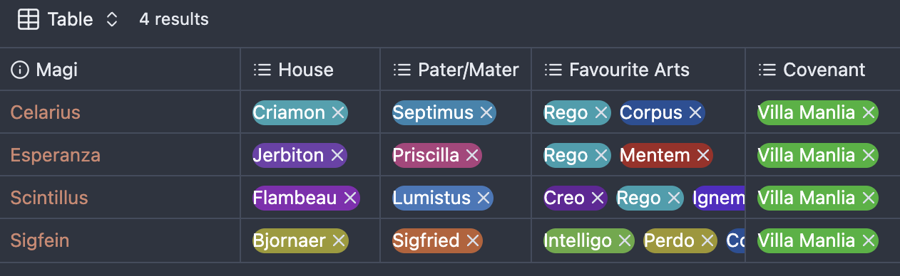
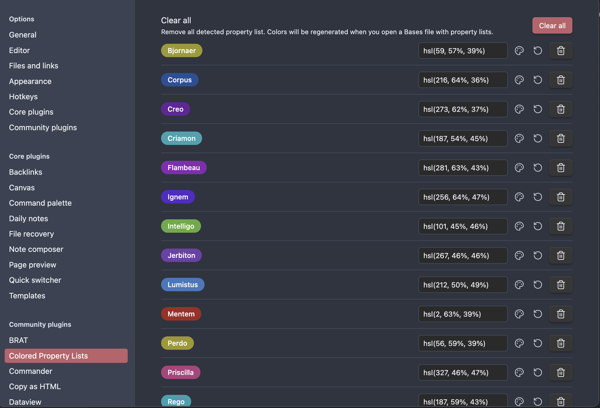

# Colored Property Lists

An Obsidian plugin that automatically detects and colors property list values in both Bases files and the file properties pane, making it easier to visually distinguish between different values.

## Features

- **Automatic Detection**: Automatically detects property list values (multi-select pills) in Bases files and file properties pane
- **Consistent Coloring**: Generates consistent colors for each unique property value using a hash-based algorithm
- **Visual Settings**: Clean settings interface with visual pill previews showing actual colors
- **Color Customization**: 
  - Manual color entry in hex or HSL format
  - Visual color picker with preview and OK/Cancel buttons
  - Reset button to restore automatically calculated colors
- **Real-time Updates**: Colors update immediately when changed in settings
- **Cross-Context Support**: Works in both Bases view and file properties pane
- **White Text**: All pills use white text for optimal readability across different background colors

## How it Works

1. **Detection**: The plugin scans for `.multi-select-pill` elements in both Bases files and the file properties pane
2. **Color Generation**: Each unique property value gets a consistent color generated from its text content using HSL color space
3. **Styling**: CSS rules are dynamically injected to color the pills with the generated or custom colors
4. **Settings Management**: All detected values appear in the plugin settings where you can customize their colors

## Settings

The plugin settings provide a clean interface for managing property list colors:

- **Visual Pills**: Each setting shows a colored pill preview on the left side
- **Color Input**: Text field for manual color entry (supports both hex and HSL formats)
- **Color Picker**: Palette button opens a modal with visual color picker and live preview
- **Reset Button**: Restore the automatically calculated default color
- **Delete Button**: Remove a property value from settings
- **Clear All**: Remove all detected values (they'll be regenerated when you open Bases files)

## Installation

### Manual Installation

1. Download the latest release from the [releases page](https://github.com/rafjaf/obsidian-colored-property-lists/releases)
2. Extract the files to your vault's `.obsidian/plugins/obsidian-colored-property-lists/` folder
3. Enable the plugin in Obsidian's Community Plugins settings

### For Development

1. Clone this repository into your vault's `.obsidian/plugins/` folder
2. Run `npm install` to install dependencies
3. Run `npm run build` to compile the plugin
4. Enable the plugin in Obsidian's settings

## Development

- `npm run dev` - Start compilation in watch mode
- `npm run build` - Build the plugin for production
- `npm run lint` - Run ESLint to check code quality

## Credits

This plugin was inspired by the excellent [Colored Tags plugin](https://github.com/pfrankov/obsidian-colored-tags) by Pavel Frankov, which provides similar functionality for tags. 

The plugin was developed with the assistance of GitHub Copilot and Claude Sonnet 4.

## License

This project is licensed under the GPL3 - see the LICENSE file for details.

## Support

If you find this plugin useful, consider:
- ⭐ Starring the repository
- 🐛 Reporting issues or suggesting features
- 🤝 Contributing improvements

## API Documentation

For Obsidian plugin development, see the [official API documentation](https://github.com/obsidianmd/obsidian-api).

## Release history
- 0.1.0 : first version published on Github
- 0.1.1 : correction brought to manifest.json to satisfy community plugin requirements